# **These are the three conceptual neighborhood graphs for simple region-region relations.**

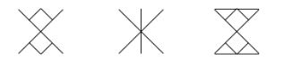

# _CNG1 from this program:_

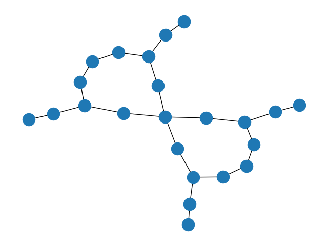

# _CNG2 from this program:_

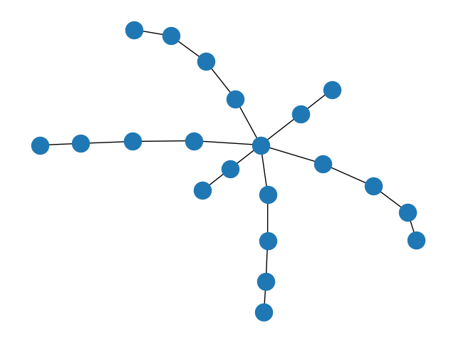

# _CNG3 from this program:_

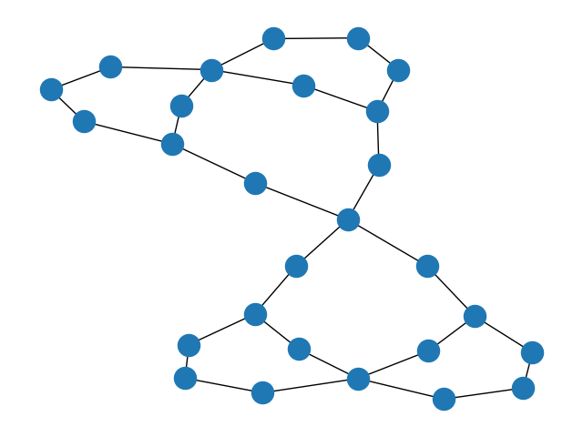

# Using a 2x2 scene description it is possible to derive similarity using the base relations’ conceptual neighborhood graph and the similarity between each of the pair of raster region relations can be determined for each one of the three conceptual neighborhood graphs as seen here.

# _CNG1_

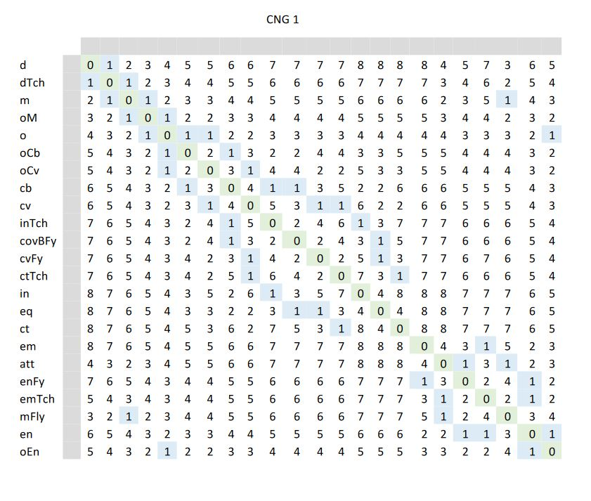

# _CNG2_

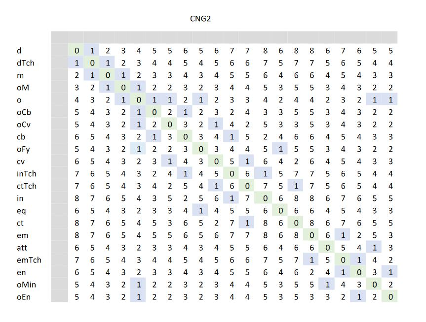

# _CNG3_

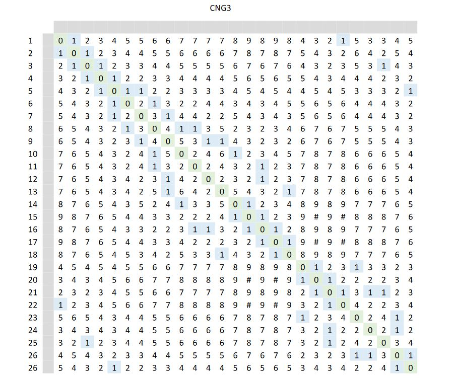
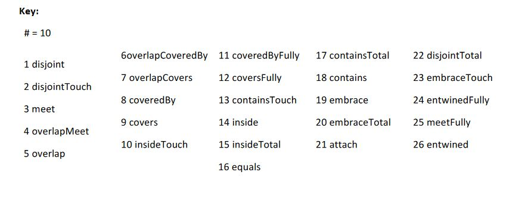

# These Conceptual neighboorhood graphs for the 29 relations between two raster regions shown below were constructed using the three sets of similarity values shown above.

# _CNG1_

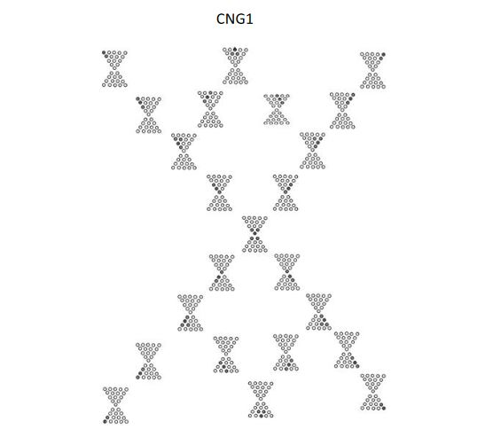

# _CNG2_

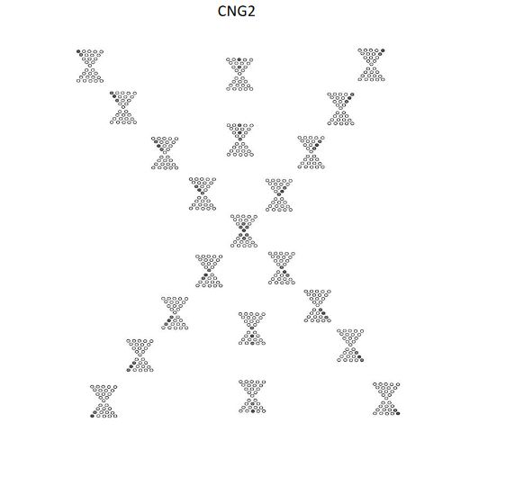

# _CNG3_

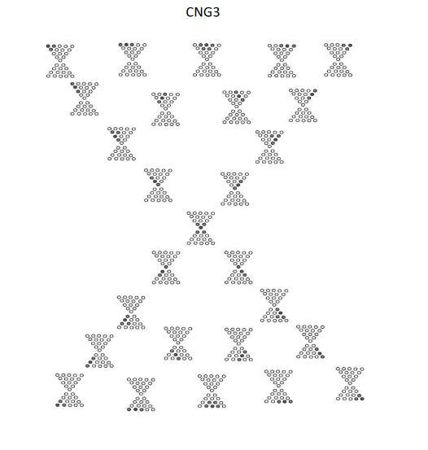
